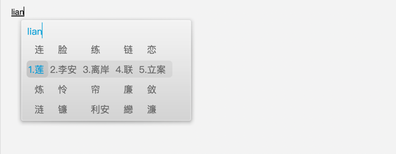
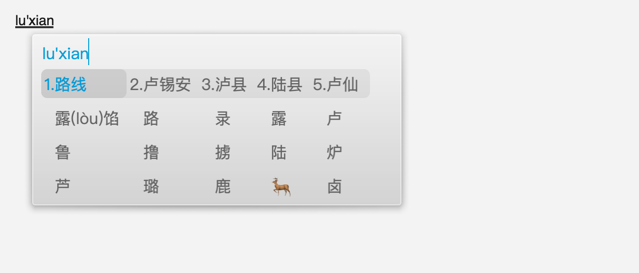
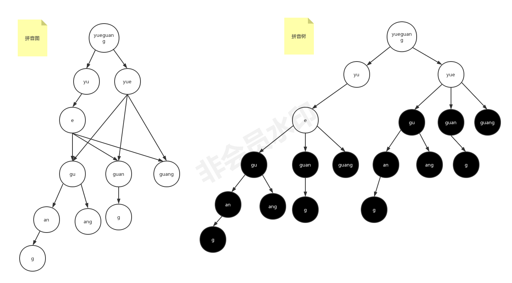

# open-pinyin

这是一个拼音解析算法,跟拼音输入法一样,就是在输入一串拼音后,输入法会将所有可能的切分变成候选供选择,本算法就是将输入的拼音解析出所有可能的排列组合  
当然,输入法会有个性化以及偏好设置,本算法的范围仅限于拼音切分.

拿搜狗输入法来举例:  
输入 "lian" 候选结果有: **"脸"[lian] "连"[lian] "练"[lian]  "李安"[li'an]**... 

 

输入 "luxian"候选结果有: **"路线"[lu'xian] "卢锡安"[lu'xi'an]**... 

可见同一串拼音字符，其切分结果有多个，输入越长其结果就越多，因为不同的切分会产生新的分支(采用树结构会带来指数级别的增长).
对于输入法来说需要将把可能的结果都解析好，并根据权重把所有的切分结果根据权重排序，把概率大的候选结果放前面(当然，这是另外一个话题了。。。)

本算法是基于图数据结构（有向无环图DAG），当然也可以基于树，树结构看起来更直观，但是其弊端就是树的这种父子结构会导致很多分支，并且不同分支下可能会有大量一模一样的重复的子树结构，解析和遍历的时候都会有很多重复的工作，浪费存储也浪费计算资源
相比之下，图结构可以减少大量重复的分支，大大减少内存消耗以及重复计算带来的耗时，在极端情况下性能有10+倍的提升

 

用法
---
result := parser.Parse(input)
result结果如下： 

[lu xi a n]
[lu xi an] 
[lu xia n] 
[lu xian]

思路
---
1. 从输入字符串中取前6个字符(拼音中最长音节为6个字符)
2. 检查步骤1中所获取的6个字符是否是一个合法音节,如果是则作为候选，否则从该字符串尾部开始逐个剔除字符，直到最大的合法音节出现为止
    e.g. liaojie 前6个字符是 liaoji 显然不是一个合法音节，那就从尾部逐个剔除,直到剩下 "liao"是一个最大的合法音节
3. 基于步骤2中获取到的最长的拼音音节进行进一步解析,基于这个合法音节进一步进行切分,找出所有的候选结果
    liao从尾部继续逐个剔除会有"lia" "li" 都是合法音节
4. 步骤3中将前6个字符中的所有候选结果枚举好后,进行构建分支(每一个解析好的候选音节对应的剩余字符串都不一样),每个分支节点中存储的都是一个合法候选音节+剩余字符串
    经过了步奏1-3就会得出第一轮候选结果"li" "lia" "liao"3个，对应有3条分支，每个分支剩余的未解析字符串为 "aojie","ojie", "jie"
5. 基于步骤4所解析的分支:"li" "lia" "liao",逐个节点进行递归解析（从步骤1开始，逐个分支进行解析）,直到剩余字符串全部解析完毕

当然，对于一些非法输入会解析出来一些非法的音节,如"anzn",解析完之后的结果是 ["an", "z", "n"],显然第二以及第三个是非完整的音节,
对于这种情况，核心的解析算法没有进行校验（现代输入法也是这样处理，有一定的容错能力），对于有需要的场景，可以在解析引擎输出结果后做结果的检查校验，剔除掉非法的音节组合即可,简单暴力,但有效.

以上就是全部.